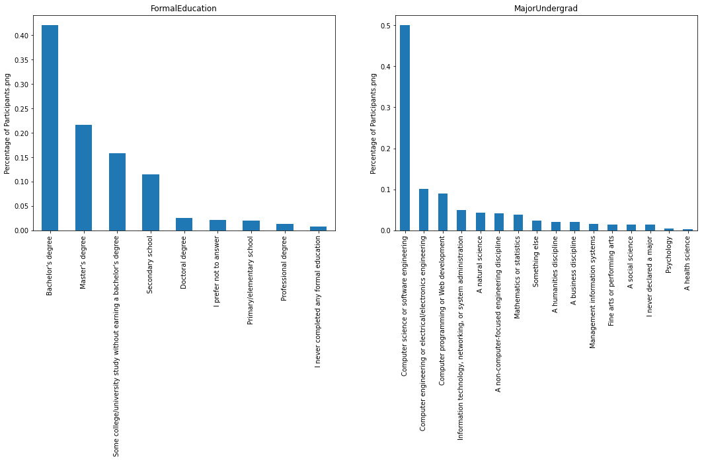
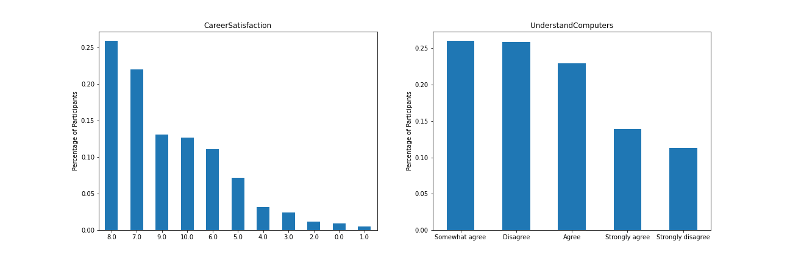

# What is the background of developers and their career satisfaction 
A data based approach using StackOverflow's developer survey data from 2017.

## Introduction
It is widely accepted that the high tech field offers amazing salary and welfare package, which attracts increasingly more professionals from other areas. However, it is still unknown that who might be interested in and more willing to moving their current careers towards the high tech field. People may have different point of view on this, yet the survey data collected from current developers by Stack Overflow may give valuable insights into the questions of interest. The survey data covers 64,000 reviews from 213 countries and territories. The survey aims to understand multiple aspects of jobs related to software development and data analytics. 

We are interested in deep diving the solutions to three questions of interest:

* What is the academic background of a developer?
* How many years of programming experiences do the developers typically have?
* Do developers satisfy their career?

## Part I: What is the academic background of a developer?

Are people with advanced degrees more likely to switch to a career as software engineer, or those without formal education? What are the academic background of those engaging in the developer career? 

<figcaption>The academic background of developers<figcaption> describes the academic background of the participants. More than 40% of the participants are holding a Bachelor degree and 20%+ holding a Master. Those without formal eduction experience have less sense to switch their careers to the high tech field. More than 75% of the developers have the computer or IT background. Most of them come from computer science or software engineering. The rest are from science, engineering, and other fields. 

 describe the career satisfaction and computer understanding of the participants. More than 70% of the participants satisfy their career with the satisfactory level ranging from 7 to 10. Also, more than half of them think that they understand computer well, yet near 40% think that they don't know a lot about computer and need further trainings. 

## Part II: 

## How many years 
## Header 2
### Header 3

- Bulleted
- List

1. Numbered
2. List

**Bold** and _Italic_ and `Code` text

[Link](url) and 
```

For more details see [Basic writing and formatting syntax](https://docs.github.com/en/github/writing-on-github/getting-started-with-writing-and-formatting-on-github/basic-writing-and-formatting-syntax).

### Jekyll Themes

Your Pages site will use the layout and styles from the Jekyll theme you have selected in your [repository settings](https://github.com/AlexWangVT/blog_post_project/settings/pages). The name of this theme is saved in the Jekyll `_config.yml` configuration file.

### Support or Contact

Having trouble with Pages? Check out our [documentation](https://docs.github.com/categories/github-pages-basics/) or [contact support](https://support.github.com/contact) and we’ll help you sort it out.
