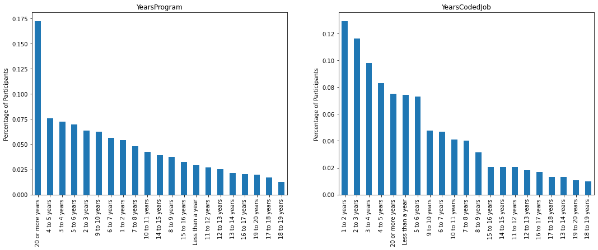

# What is the background of developers and their career satisfaction
A data based approach using StackOverflow's developer survey data from 2017.

## Introduction
It is widely accepted that the high tech field offers amazing salary and welfare package, attracting increasingly more professionals from other fields. However, it is still unknown who is more likely to become a developer and how long they may stay in the field. People may have different point of view on this, yet the survey data collected from current developers by Stack Overflow may give valuable insights into the questions of interest. The survey data covers 64,000 reviews from 213 countries and territories. The survey aims to understand multiple aspects of jobs related to software development and data analytics. 

We are interested in deep diving the solutions to three questions of interest:

* What are academic backgrounds of developers?
* Do developers satisfy their career?
* How long do developers stay in the field?

## Part I: Academic backgrounds of developers

Are people with advanced degrees more likely to switch to a career as software engineer, or those without formal education? What are the academic background of those engaging in the developer career? 

Fig.1-The academic background of developers
 
Figure 1 describes the academic background of the participants. More than 40% of the participants are holding a Bachelor degree and 20%+ holding a Master. Those without formal eduction experience have less sense to switch their careers to the high tech field. More than 75% of the developers have the computer or IT background. Most of them come from computer science or software engineering. The rest are from science, engineering, and other fields. 

## Part II: Do developers satisfy their career?

Fig.2-Career satisfaction and computer understanding of developers
 
Figure 2 gives valuable insights into the career satisfaction and computer understanding of the participants. More than 70% of the participants satisfy their career with the satisfactory level ranging from 7 to 10. Also, more than 60% of the participants think that they don't know a lot about computer but are willing to get further trainings to promote their careers in this field. 

## Part III: How long do developers stay in the field?

Fig.3-Years of programming and coding job
 
Figure 3 analyzes how long a developer typically stays in the field. Interestingly, most of the developers have less than 10 years of programming or coding job experience with an exception of the group with 20 more years. This implies that switching to another career mostly occur between 10 and 20 years of becoming a developer. Those coding more than 20 years are less likely to jump to a new field. But why is that? 

## Conclusion
In this article, we provide a preliminary analysis about the background of developers, their career satisfaction, and how long they will stay in the field. 
1. Most of the developers have computer or IT background with Bacherlor degree or higher. 
2. Most of them satisfy their career and are willing to participate in more trainings for better understanding computer knowledges.
3. Switching to a new career mostly happen 10-20 years after someone become a develper.

The findings are observational and preliminary, and trigger an interesting question: 
Why does career-hopping often occur 10-20 years after someone become a develper?

